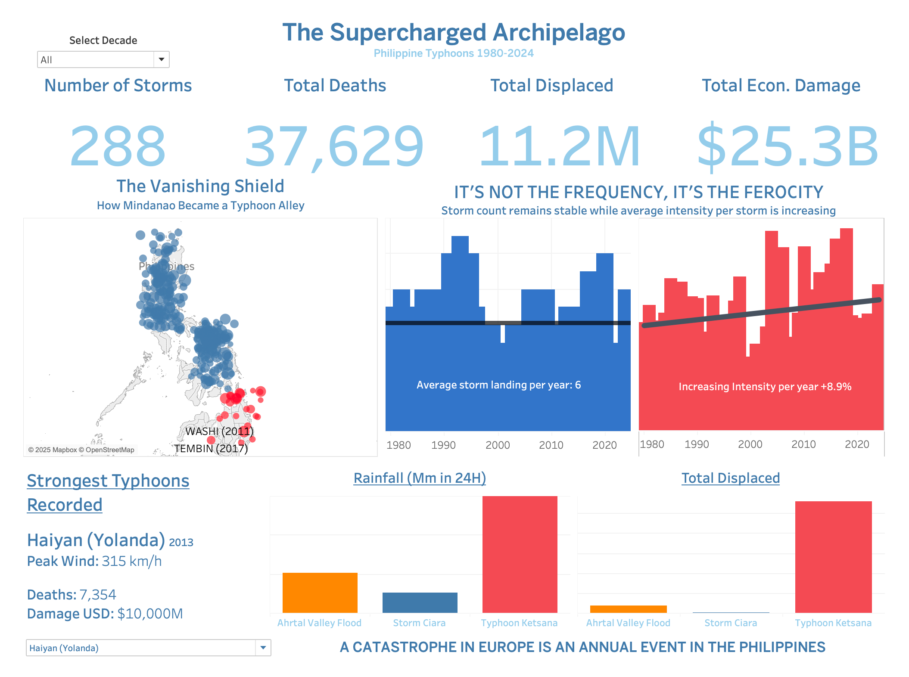
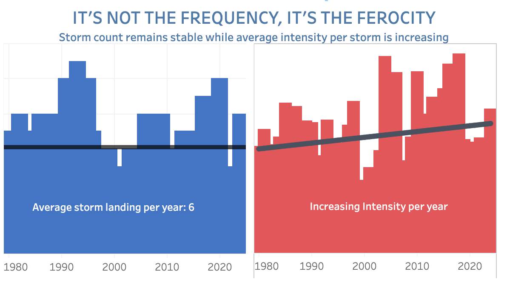

# 🌀 The Supercharged Archipelago
### A Data-Driven Narrative of Philippine Typhoons (1980-2024)

[](https://public.tableau.com/app/profile/vennel.chenfoo/viz/TheSuperchargedArchipelagoPhilippineTyphoons1980-2024/Dashboard1)
[](https://streamlit.io/)
[](https://python.org)
[](https://opensource.org/licenses/MIT)



---

## 📖 The Story Behind This Project

### A Personal Journey from Survivor to Data Scientist

On December 16, 2011, Tropical Storm Washi—locally named **Sendong**—struck Northern Mindanao. What was technically classified as a "weak" tropical storm unleashed catastrophic flash floods that swept through Cagayan de Oro and Iligan City in the dead of night, killing over **1,200 people** and displacing hundreds of thousands.

**I was there.**

My hometown became a graveyard. Neighbors I grew up with were buried in mud. Entire communities along the riverbanks—families who had lived there for generations—were erased in hours. The official death toll was 1,268, but those of us on the ground knew the real number was higher. Bodies were still being found weeks later, tangled in debris kilometers downstream.

### From Relief Worker to Activist

What followed was nearly a year of my life dedicated to the aftermath:

- **Relief Operations**: Distributing food, water, and supplies to evacuation centers
- **Rehabilitation Work**: Helping rebuild homes and livelihoods with local and international NGOs
- **Survivors' Collective**: Organizing affected communities to demand accountability
- **Advocacy Campaigns**: Confronting the systems that turned a storm into a massacre

We marched. We filed cases. We named names.

The floods weren't just "natural." The walls of mud and logs that crushed homes came from somewhere:
- **Mono-crop plantations** that stripped hillsides bare for pineapple and banana exports
- **Logging operations** that left watersheds unprotected
- **Large-scale mining** that destabilized entire mountainsides
- **Government neglect** that never provided the needed immediate relief and long-term rehabilitation

Sendong taught me that disasters are political. The storm was the trigger, but decades of environmental destruction and institutional failure loaded the gun.

### Why Data Science?

Fourteen years later, I'm completing a Data Science & AI bootcamp in Germany. I needed to apply my lessons to real life experience. 

This project is my way of continuing the fight—but with new tools.

**The data confirms what survivors have always known:**
- Storms aren't getting more frequent—they're getting **more ferocious**
- Regions once considered "safe" are now in the crosshairs
- What Europe calls a "once-in-500-years catastrophe" is the Philippines' **annual reality**

This is data science as activism. This is memory as methodology.

---

## 🎯 Project Overview

### The Core Question

> **Is the Philippines experiencing more typhoons, or more destructive typhoons?**

### The Answer: The Philippine Typhoon Paradox

The data reveals a critical paradox that challenges common assumptions:

| Metric | Trend | Implication |
|--------|-------|-------------|
| Storm Frequency | **Stable** (~6/year) | Not more storms |
| Storm Intensity | **Increasing** (+0.004/year) | But stronger storms |
| Mindanao Exposure | **+XX%** since 2010 | "Safe zones" disappearing |
| Economic Damage | **+236%** over study period | Growing devastation |

**It's not the frequency. It's the ferocity.**

---

## 📊 Key Findings

### 1. The Paradox: Stable Frequency, Rising Intensity



- Storm count trend: **-0.05 storms/year** (essentially flat)
- Avg intensity trend: **+0.004 units/year** (steadily increasing)
- Individual storms are becoming **more powerful**, not more numerous

### 2. The Vanishing Shield: Mindanao Under Siege

For generations, Mindanao was marketed as "typhoon-free"—a safe haven for agriculture and investment. This assumption is now **dangerously obsolete**.

Key events that shattered the myth:
- **Washi/Sendong (2011)**: 1,268 dead from flash floods
- **Bopha/Pablo (2012)**: 1,901 dead—strongest storm ever to hit Mindanao
- **Rai/Odette (2021)**: $968M damage, 3M displaced

### 3. The Resilience Gap: Philippines vs Europe

| Event | Rainfall (24h) | Deaths | GDP Impact |
|-------|---------------|--------|------------|
| Germany Ahrtal Flood (2021) | 154mm | 180 | 0.29% |
| Typhoon Ketsana (2009) | **455mm** | 464 | 2.7% |
| Typhoon Haiyan (2013) | 200mm | **7,354** | **4.7%** |

**A catastrophe in Europe is an annual event in the Philippines.**

The Philippines absorbs nearly **3x the rainfall** that caused Germany's worst flood in centuries—and does so **every typhoon season**.

### 4. The 2024 Cluster Crisis

In late 2024, the Philippines was hit by **6 tropical cyclones in 26 days**:

1. Trami (Kristine) - Oct 22
2. Kong-rey (Leon) - Oct 27
3. Yinxing (Marce) - Nov 7
4. Toraji (Nika) - Nov 11
5. Usagi (Ofel) - Nov 14
6. Man-Yi (Pepito) - Nov 16

**13+ million people affected. Resilience capacity exceeded.**

---

## 🛠️ Technical Implementation

### Data Sources

| Source | Description | Records |
|--------|-------------|---------|
| [EM-DAT](https://www.emdat.be/) | International Disaster Database | 500+ events |
| [IBTrACS](https://www.ncei.noaa.gov/products/international-best-track-archive) | NOAA Storm Tracking Data | 50,000+ track points |
| [PAGASA](https://www.pagasa.dost.gov.ph/) | Philippine Weather Bureau | PAR definitions |

### Project Structure
```
philippines_typhoon_analysis/
│
├── 📁 data/
│   ├── raw/                    # Original datasets
│   │   ├── emdat_file.xlsx
│   │   └── ibtracs_raw.csv
│   ├── processed/              # Cleaned datasets
│   └── tableau_ready/          # Dashboard-optimized files
│
├── 📁 notebooks/
│   ├── 01_emdat_preparation.ipynb
│   └── 02_ibtracs_preparation.ipynb
│
├── 📁 src/
│   └── app.py                  # Streamlit application
│
├── 📁 assets/
│   ├── dashboard_screenshot.png
│   └── presentation.pdf
│
├── 📁 research/
│   └── The_Supercharged_Archipelago.pdf
│
├── 📄 requirements.txt
├── 📄 README.md
└── 📄 LICENSE
```

### Key Metrics Calculated
```python
# Intensity Proxy (per storm)
intensity = (max_wind_kt ** 2) / 10000

# Storm categorization (Saffir-Simpson Scale)
Cat 5: >= 137 kt (Super Typhoon)
Cat 4: 113-136 kt
Cat 3: 96-112 kt
Cat 2: 83-95 kt
Cat 1: 64-82 kt

# Mindanao threshold
Below 10°N latitude = Historically rare typhoon zone
```

### Technologies Used

- **Python 3.11+**: Data processing and analysis
- **Pandas & NumPy**: Data manipulation
- **SciPy**: Statistical analysis and trend calculations
- **Plotly**: Interactive visualizations
- **Tableau Public**: Dashboard publication
- **Streamlit**: Interactive web application
- **Claude AI**: Development assistance and code refinement

---

## 🖥️ Interactive Dashboard

### Tableau Public

**[View Live Dashboard →](https://public.tableau.com/app/profile/vennel.chenfoo/viz/TheSuperchargedArchipelagoPhilippineTyphoons1980-2024/Dashboard1)**

Features:
- Decade filter for temporal analysis
- KPI cards (storms, deaths, displaced, damage)
- Frequency vs Intensity dual-axis chart
- Geographic track visualization
- Europe comparison charts
- Storm spotlight selector

### Streamlit Application

[Streamlit]https://philippinestyphoonanalysis-givmhaeuxgrljwqsw82npx.streamlit.app/
```

---

## 📚 Research Foundation

This analysis is supported by extensive research documented in:

📄 **[The Supercharged Archipelago: Research Report](research/The_Supercharged_Archipelago.pdf)**

Key sources include:
- World Weather Attribution climate studies
- Carbon Brief analysis of 2024 typhoon season
- Munich Re economic impact assessments
- Academic papers on rapid intensification
- PAGASA historical records

---

## 🚀 Getting Started

### Prerequisites

- Python 3.11 or 3.12 (not 3.14—many packages lack support)
- Tableau Public account (for dashboard viewing)
- ~500MB disk space for datasets

### Installation
```bash
# 1. Clone the repository
git clone https://github.com/yourusername/philippines-typhoon-analysis.git
cd philippines-typhoon-analysis

# 2. Create and activate virtual environment
python3.11 -m venv .venv
source .venv/bin/activate

# 3. Install dependencies
pip install -r requirements.txt

# 4. Download IBTrACS data (if not included)
# The IBTrACS file is too large for GitHub. Download manually:
# Visit: https://www.ncei.noaa.gov/data/international-best-track-archive-for-climate-stewardship-ibtracs/v04r01/access/csv/
# Download: ibtracs.WP.list.v04r01.csv
# Rename to `ibtracs_raw.csv` and place in `data/raw/`

# 5. Run notebooks in order
jupyter notebook notebooks/01_emdat_preparation.ipynb
jupyter notebook notebooks/02_ibtracs_preparation.ipynb

# 6. Launch Streamlit app
[Streamlit App]
```

### Requirements
```txt
pandas>=2.0.0
numpy>=1.24.0
scipy>=1.10.0
plotly>=5.15.0
streamlit>=1.28.0
openpyxl>=3.1.0
jupyter>=1.0.0
```

---

## 📈 Future Development

- [ ] **Predictive Modeling**: ML models for intensity forecasting
- [ ] **Real-time Integration**: PAGASA API for live storm tracking
- [ ] **Community Impact Layer**: Socioeconomic vulnerability mapping
- [ ] **Climate Attribution**: Deeper analysis of anthropogenic signals

---

## 🤝 Contributing

This project welcomes contributions, especially from:
- Filipino data scientists and researchers
- Climate scientists and meteorologists
- Disaster risk reduction practitioners
- Survivors and advocates

---

## 📜 License

This project is licensed under the MIT License - see [LICENSE](LICENSE) for details.

Data sources retain their original licenses:
- EM-DAT: Academic use with attribution
- IBTrACS: Public domain (NOAA)

---

## 🙏 Acknowledgments

- **To the survivors of Sendong** and every typhoon since—your resilience is the reason this work exists
- **To the volunteers and organizers** who showed me that solidarity is survival
- **To my WBS Coding School cohort** for the support throughout the bootcamp
- **To Claude AI (Anthropic)** for development assistance
- **To the open data community** that makes this analysis possible

---

## 📬 Contact

**Vennel Chenfooo**

- LinkedIn: [[LinkedIn](https://www.linkedin.com/in/vennelchenfoo/)]
- GitHub: [[Your GitHub Profile](https://github.com/vennelchenfoo)]
- Email: [vennel@vennelchenfoo.me]
- Portfolio [[vennelchenfoo.me](https://vennelchenfoo.me/)]

---

<div align="center">

### *"The story is no longer just about resilience; it is about survival in a supercharged climate."*

**If you found this project meaningful, please ⭐ star this repository.**

</div>